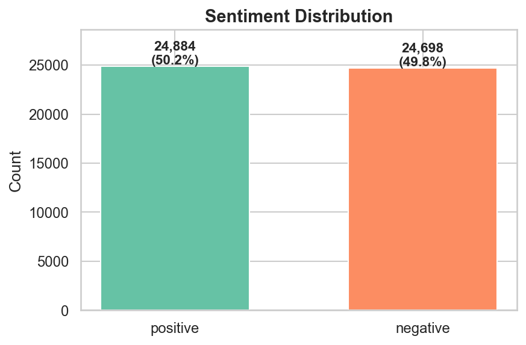
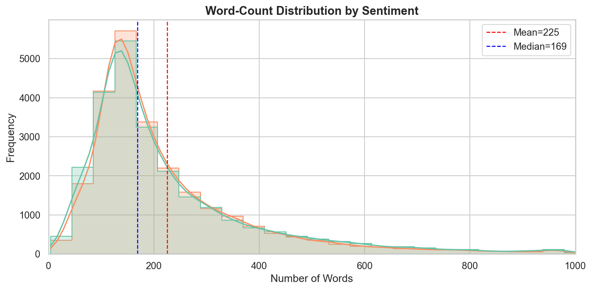

# IE 423 Project Proposal — Sentiment Analysis on IMDB Movie Reviews

## Team Information

**Team Name:** AbsoluteCinema

- Semih Yavuz
- Mert Ata Tekçe
- Çağan Gökta
- Emir Türkseven

## Dataset Explanation

This projects [obtained from Kaggle.com](https://www.kaggle.com/datasets/lakshmi25npathi/imdb-dataset-of-50k-movie-reviews) **IMDB Dataset of 50K Movie Reviews** uses (50.000 IMDB Movie Reviews) dataset.  
This dataset has 50,000 movie reviews with positive and negative labels for Natural Language Processing (NLP) and text analysis.
The reason for us to choose this dataset: suitable for binary sentiment classification; also it allows us to recognize some patterns such as sarcasm, strong emotions expressed with punctuations etc. .

## Accessing the Dataset

The raw dataset may not be always accessible from the repository because of the file size or some licensing issues. It should be placed at this filepath after downloaded:

`data/raw/IMDB Dataset.csv`

For more info take a look at: `data/README.md`.

## Research Questions

### Araştırma Sorusu 1: Text Longevity and Model Behaviour

How is the text longevity related to correctly classifying the sentiment of the review? How reliable is the distinction based on text longevity when positive and negative comments have a similar number of texts?

**Explonation:**  
`outputs/figures/sentiment_distribution.png` this graph, shows that after preprocessing, the classes are **almost balanced**. (the numerical summary is visible at `outputs/tables/03_eda_summary.csv`; example: negative 24.698, positive 24.884). This shows no dominance between the two grups and therefore no reason for oversampling/undersampling. On the other hand, `outputs/figures/review_length_distribution.png` shows that the distribution among both groups is **quite similar** and **right skewed**. Also a density peak is visible for reviews around **100–200 words**; most of them consists of **50–300 words** and even though it is rare it shows a tail until it reaches **1000 words**. This finding, suggest that the sentiment is probably more related to which **words or context** has been used rather than how many words used on the review and it shows that the text longevity can't be the **main approach** to analyze but may be helpful as a side/helper parameter. However, we as a group still want to categorize the reviews to lengtal groups to observe on which category our model struggles the most.

### Research Question 2: The Effects Preprocessing Holds on Interpretabity

The impact of removing stop-words (the,a etc.) or deleting punctuation and numbers on sentiment classification in movie reviews.

**Explonation:**  
The standard pipelines in preprocessing usually removes punctuations and repeating words. However, these can be a sentimental signal in movie reviews. This question is asked in order to understand if cleaning the data too much disrupts the naturality of real-world text/review.

### Araştırma Sorusu 3: Research Question 3: Linguistic Patterns in Wrong Classifications

In cases where the baseline model systematically misclassify, are there any common linguistic patterns?

**Açıklama:**  
The same word may mean different things in different kinds of movies("scary" can be a good signal for a horror movie whereas for a romantic-comedy it probably won't be). If the model fails to make the distinguishment between these different scenerios, it may repetatively fail on some specific words. We as a group, seek to identify those mistakes one-by-one in order to understand where the model struggles the most. This will enable us to have a more accurate analysis while we comment on some results(F1,ROC etc.).

## Project Proposal

In this project we seek to make sentimental analysis on movie reviews using machine learning models. 

### What have we done?
- **Cleaning:** We deleted repetative data and made the text model-ready (`scripts/02_preprocess_data.py`).
- **Analysis:** We observed almost 50/50 distribution among positive and negative numbers. We found that the text longevity as a main/only indicator won't be enough (`scripts/03_basic_eda.py`).

### What will we do?
- **Modeling:** We are going to vectorize the data which consists of reviews and train models like Logistic Regression and Naive Bayes.
- **Değerlendirme:** We are going to use F1-Score and ROC curves for analysis/evaluation. We want to see not only the high scores but also why the model fails on some words.

### Some issues which may occur
- **Sarcastic Comments:** Trying to understand the meaning of a sarcastic review.
- **Efficient Use of Resources:** Using the hardware (espacially RAM) in a efficient way while processing the data.

## Preprocessing steps

### Step 1 — Loading Data

`scripts/01_load_data.py` reads the raw CSV, prints the shape and missing summary to the console, and saves the summary table into the `outputs/tables/01_load_summary.csv` file.

### Step 2 — Inspection and Cleaning

With `scripts/02_preprocess_data.py`:

- Duplicate rows are dropped based on the `review` field (numerical summary is in `outputs/tables/02_preprocess_summary.csv`).
- Rows with missing values are removed (no missing values were observed in the raw stage of this dataset; summary can be traced via `01_load_summary.csv`).
- HTML tags (e.g., `<br />`) are removed from the text using BeautifulSoup; non-alphabetic and non-space characters are removed with regular expressions; text is converted to lowercase and extra spaces are simplified (`cleaned_review`).
- `sentiment` labels are converted to numbers for machine learning (`sentiment_label`: negative 0, positive 1).

### Step 3 — Saving Processed Data

The clean data is written to:  
`data/processed/cleaned_imdb_reviews.csv`  
(Columns: Original `review`, `sentiment`, `cleaned_review`, `sentiment_label`).

---

## Initial Outputs

### Raw and Processed Data Summary

- Raw data size matches the output of `scripts/01_load_data.py` and `outputs/tables/01_load_summary.csv`: **50,000** rows, **2** columns; missing values: **0**.
- Preprocesing summary is generated from the `outputs/tables/02_preprocess_summary.csv` file: after deleting **418** duplicate rows, **49,582** rows and **4** columns remain.

These numbers are designed to be verified through the tables written by the scripts, not just as static text (transparency and reproducibility).

### Example Visualizations

The following graphs were produced by `scripts/03_basic_eda.py`.

**Sentiment distribution:** The bars are allmost the same height; even after deleting duplicate rows, classes are approximately balanced (exact numbers are in `outputs/tables/03_eda_summary.csv`). Therefore, aggressive class balancing is an unimportant step in preprocessing.

**Word count distribution:** Positive and negative curves overlap; the peak is around 100–200 words, the distrubution is right-skewed and most reviews are in the 50–300 word band. For this reason, in **Research Question 1**, we plan to handle length beyond the general average with section-based and error analysis.





Numeric EDA summary: `outputs/tables/03_eda_summary.csv`

## How to Run the Project

### 1. Clone the repository

```bash
git clone https://github.com/BILGI-IE-423/ie423-2025-2026-termproject-absolutecinema.git
cd AbsoluteCinema
```

### 2. Install packages

```bash
pip install -r requirements.txt
```

### 3. Place the data file

Put `IMDB Dataset.csv` in `data/raw/` (see `data/README.md`).

### 4. Run the scripts in order

```bash
python scripts/01_load_data.py
python scripts/02_preprocess_data.py
python scripts/03_basic_eda.py
```

Expected outputs: `data/processed/cleaned_imdb_reviews.csv`, `outputs/figures/*.png`, `outputs/tables/*.csv`.

## Transparency and Traceability

The figures in this document are located in `outputs/figures/`. The summary tables are stored in `outputs/tables/`. All of them are produced by the Python scripts in `scripts/`:

| Output | Script |
|--------|--------|
| `outputs/tables/01_load_summary.csv` | `scripts/01_load_data.py` |
| `data/processed/cleaned_imdb_reviews.csv`, `outputs/tables/02_preprocess_summary.csv` | `scripts/02_preprocess_data.py` |
| `outputs/figures/*.png`, `outputs/tables/03_eda_summary.csv` | `scripts/03_basic_eda.py` |

Someone else can install the packages, use the same raw data, and run the scripts in this order to reproduce the same outputs.

