# IE 423 Project Proposal — Sentiment Analysis on IMDB Movie Reviews

## Team Information

**Team Name:** AbsoluteCinema

- Semih Yavuz
- Mert Ata Tekçe
- Çağan Göktaş
- Emir Türkseven

## Dataset Description

This project uses the [IMDB Dataset of 50K Movie Reviews](https://www.kaggle.com/datasets/lakshmi25npathi/imdb-dataset-of-50k-movie-reviews) obtained from Kaggle.com (50,000 IMDB movie reviews).  
This dataset has 50,000 movie reviews with positive and negative labels for Natural Language Processing (NLP) and text analysis.
The reason for choosing this dataset: it is suitable for binary sentiment classification; it also allows us to explore patterns such as sarcasm, strong emotions expressed with punctuation, etc.

## Accessing the Dataset

The raw dataset may not always be accessible from the repository because of file size or licensing issues. It should be placed at this filepath after downloading:

`data/raw/IMDB Dataset.csv`

For more info take a look at: `data/README.md`.

---

## Preprocessing Steps

### Step 1 — Loading Data

`scripts/01_load_data.py` reads the raw CSV, prints the shape and missing summary to the console, and saves the summary table into `outputs/tables/01_load_summary.csv`.

### Step 2 — Inspection and Cleaning

With `scripts/02_preprocess_data.py`:

- Duplicate rows are dropped based on the `review` field (numerical summary is in `outputs/tables/02_preprocess_summary.csv`).
- Rows with missing values are removed (no missing values were observed in the raw stage of this dataset; summary can be traced via `01_load_summary.csv`).
- **Aggressive cleaning** (`cleaned_review`): HTML tags (e.g., `<br />`) are removed using BeautifulSoup; non-alphabetic and non-space characters are removed with regular expressions; text is converted to lowercase and extra spaces are simplified.
- **Light cleaning** (`cleaned_review_light`): Only HTML tags are removed and text is lowercased — punctuation and numbers are preserved. This supports the Research Question 2 comparison.
- Reviews that become empty after aggressive cleaning are detected and dropped.
- `sentiment` labels are converted to numeric (`sentiment_label`: negative → 0, positive → 1).
- Derived features `word_count` and `char_count` are computed for EDA and modeling.

### Step 3 — Saving Processed Data

The clean data is written to:  
`data/processed/cleaned_imdb_reviews.csv`  
(Columns: `review`, `sentiment`, `cleaned_review`, `cleaned_review_light`, `sentiment_label`, `word_count`, `char_count`).

### Key Preprocessing Statistics

| Metric | Value |
|--------|-------|
| Raw rows | 50,000 |
| Duplicates dropped | 418 |
| Null rows dropped | 0 |
| Empty-after-cleaning dropped | 0 |
| Final processed rows | 49,582 |
| Positive reviews | 24,884 (50.19%) |
| Negative reviews | 24,698 (49.81%) |
| Class balance ratio (pos/neg) | 1.0075 |
| Columns in processed dataset | 7 |

---

## Exploratory Data Analysis (EDA)

The following analyses were produced by `scripts/03_basic_eda.py`. A total of **18 figures** and **9 summary tables** were generated.

### 1. Sentiment Distribution

The classes are **almost perfectly balanced**: 24,884 positive (50.19%) vs. 24,698 negative (49.81%). This means aggressive class-balancing techniques (SMOTE, undersampling, etc.) are unnecessary and the dataset is directly suitable for training.


---

### 2. Review Word-Count Distribution

The word-count distributions of both sentiment classes **overlap significantly**. Both are **right-skewed** with a peak at **100–200 words**. The mean (225 words) is marked with a red dashed line and the median (169 words) with blue. The gap between mean and median confirms the right-skew caused by long-tail reviews.


---

### 3. Violin Plot — Word Count by Sentiment

The violin plot shows the full **probability density** of word counts for each class. Both violins are virtually identical in shape, confirming that review length is **not a strong differentiator** between positive and negative sentiment.

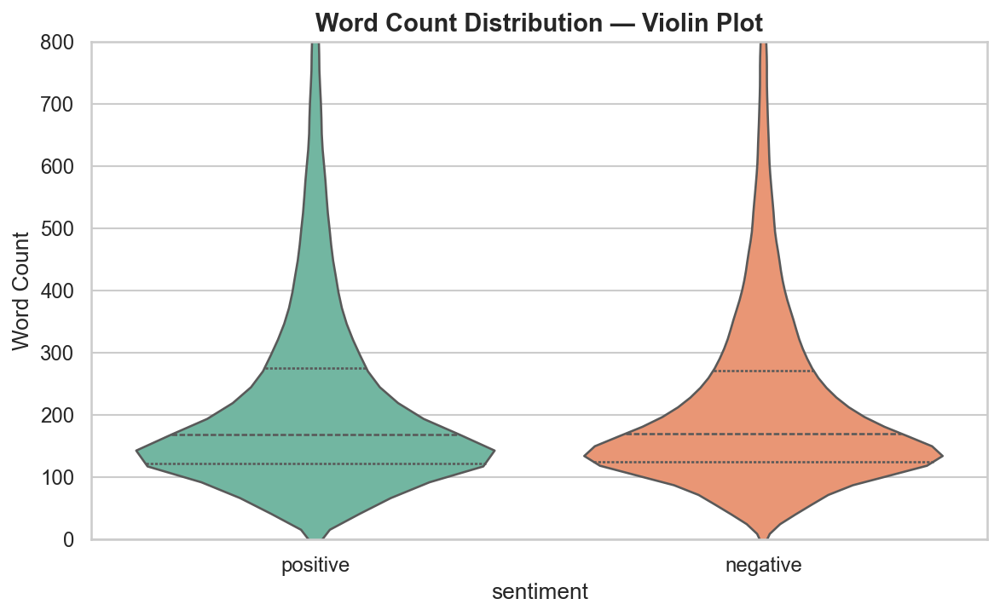

---

### 4. Boxplot — Word Count by Sentiment

The boxplot confirms that **median, Q1, and Q3 are nearly identical** for both classes. Outliers extend beyond 1,000 words, but they represent a small fraction of the data.

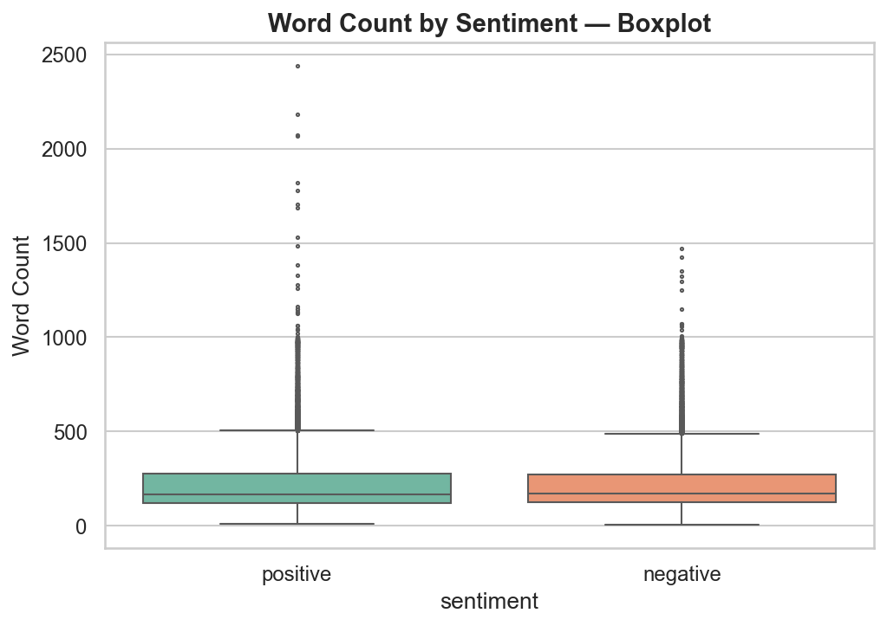

#### Descriptive Statistics — Word Count

| Statistic | Overall | Positive | Negative |
|-----------|---------|----------|----------|
| Count | 49,582 | 24,884 | 24,698 |
| Mean | 225.39 | 227.36 | 223.40 |
| Std | 167.13 | 173.38 | 160.57 |
| Median | 169 | 168 | 170 |
| Min | 4 | — | — |
| Q1 (25%) | 123 | — | — |
| Q3 (75%) | 273 | — | — |
| Max | 2,441 | — | — |

#### Review Length Bucket Distribution

| Bucket | Count | Percentage |
|--------|-------|------------|
| 0–50 words | 1,344 | 2.71% |
| 51–100 words | 5,252 | 10.59% |
| 101–200 words | 23,408 | 47.21% |
| 201–300 words | 9,054 | 18.26% |
| 301–500 words | 6,874 | 13.86% |
| 500+ words | 3,650 | 7.36% |

---

### 5. Character-Count Distribution

The character-count distribution mirrors the word-count pattern. Mean character count is **1,240** (positive: 1,258, negative: 1,223). This confirms that review length — whether measured by words or characters — does not carry strong sentiment signal.

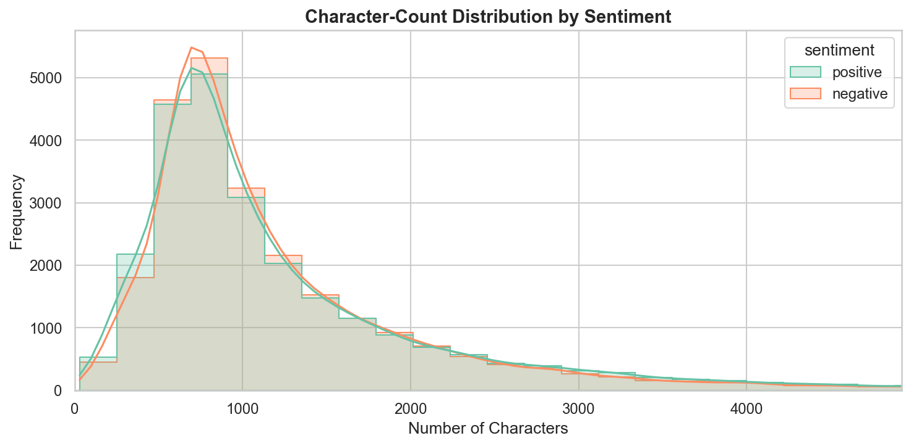

#### Descriptive Statistics — Character Count

| Statistic | Overall | Positive | Negative |
|-----------|---------|----------|----------|
| Mean | 1,240.45 | 1,257.54 | 1,223.22 |
| Std | 938.90 | 980.24 | 895.01 |
| Median | 920 | 919 | 921 |
| Min | 30 | — | — |
| Max | 13,262 | — | — |

---

### 6. Average Word Length Distribution

The average word length per review is approximately **4.48 characters** for both classes (std = 0.33). The distributions overlap completely, meaning that positive and negative reviewers do not differ in their vocabulary complexity.

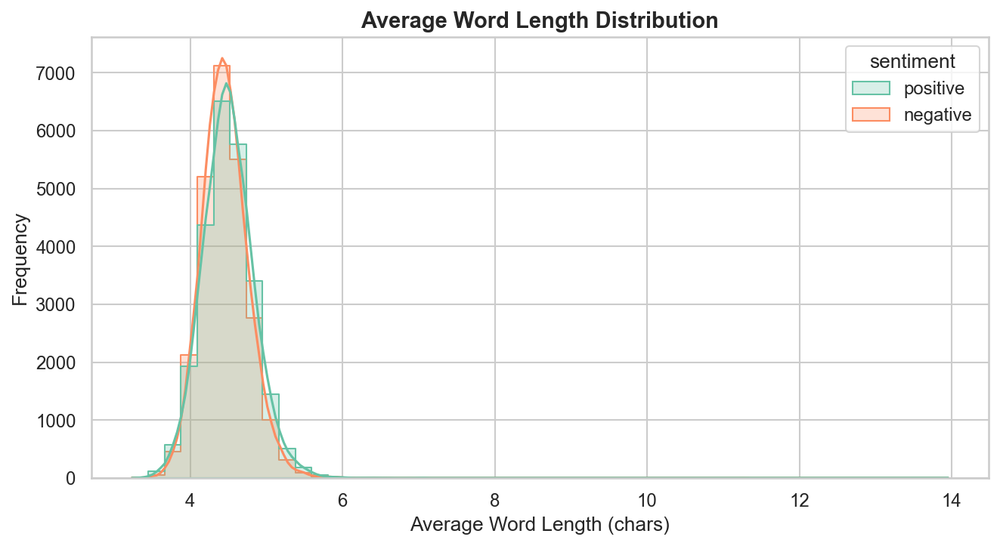

| Statistic | Value |
|-----------|-------|
| Mean avg word length | 4.48 chars |
| Std | 0.33 |
| Min | 3.23 |
| Max | 13.95 |

---

### 7. Top-25 Most Frequent Words (Stopwords Removed)

After removing English stopwords, the most frequent words reveal clear sentiment signals:

- **Positive:** "film", "movie", "one", "like", **"good"**, **"great"**, "story", "see", "time", **"well"**, **"love"**, **"best"**
- **Negative:** "movie", "film", "one", "like", "even", **"bad"**, "good", **"dont"**, "get", "much", "story", "people"

Key observation: Words like **"great", "love", "best"** appear heavily in positive reviews but rarely in negative ones. Conversely, **"bad", "dont", "waste", "worst"** are concentrated in negative reviews. This suggests that unigram-based models will have reasonable discriminative power.

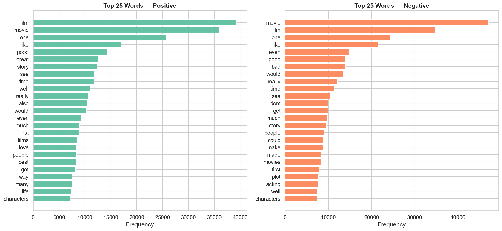

---

### 8. Top-20 Bigrams (Two-Word Phrases)

Bigram analysis reveals more expressive sentiment patterns:

- **Positive bigrams:** "one best", "great movie", "good movie", "well done", "must see", "pretty good"
- **Negative bigrams:** "waste time", "bad movie", "worst movie", "low budget", "one worst"

The bigram **"waste time"** is the strongest negative signal — it appears 1,400+ times and almost exclusively in negative reviews.

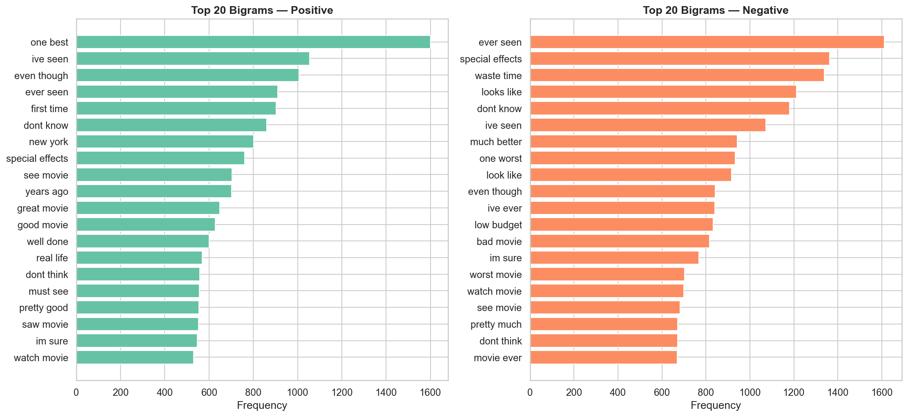

---

### 9. Top-15 Trigrams (Three-Word Phrases)

Trigram analysis uncovers even richer multi-word sentiment patterns that unigram models cannot capture.

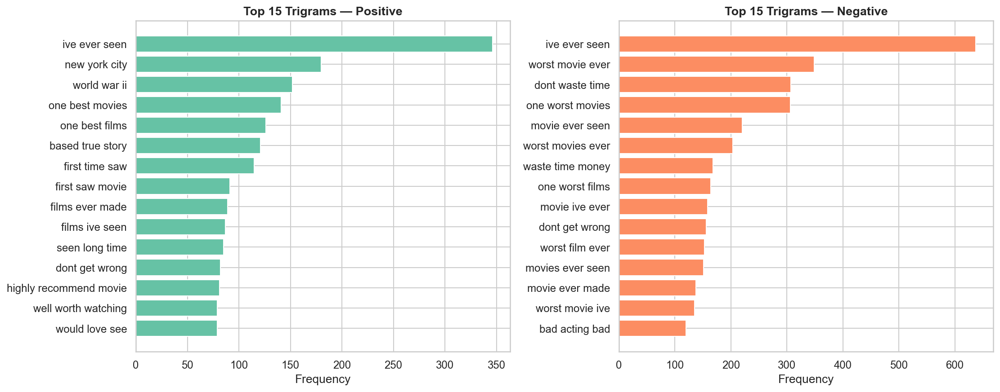

---

### 10. TF-IDF Discriminative Words

Using TF-IDF vectorization (5,000 features, English stopwords removed), we computed the **mean TF-IDF score per class** and ranked words by the difference. This identifies the most statistically discriminative words:

- **Strongest positive signals:** "great" (highest), "love", "best", "excellent", "wonderful", "loved", "perfect", "beautiful", "amazing", "brilliant"
- **Strongest negative signals:** "bad" (highest), "worst", "movie", "waste", "awful", "terrible", "boring", "stupid", "horrible", "poor"

This analysis provides a quantitative foundation for understanding what a TF-IDF-based classifier will rely on most.

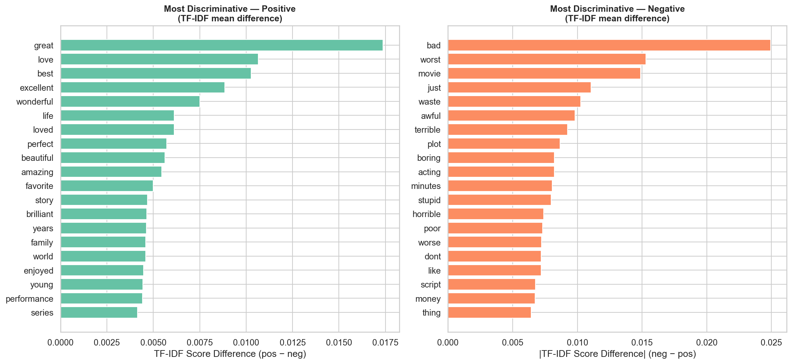

---

### 11. Log-Odds Ratio — Sentiment-Specific Words

The log-odds ratio (log₂) measures how strongly a word is associated with one class versus the other. Words with a high positive ratio appear almost exclusively in positive reviews, and vice versa.

Notable findings:
- Words like **"flawless", "superbly", "wonderfully", "perfection"** are extremely positive-specific
- Words like **"awful", "waste", "godawful", "unfunny", "unwatchable"** are extremely negative-specific
- Interestingly, certain **proper nouns** (e.g., actor/director names) also show strong sentiment bias — this could be a source of spurious correlation

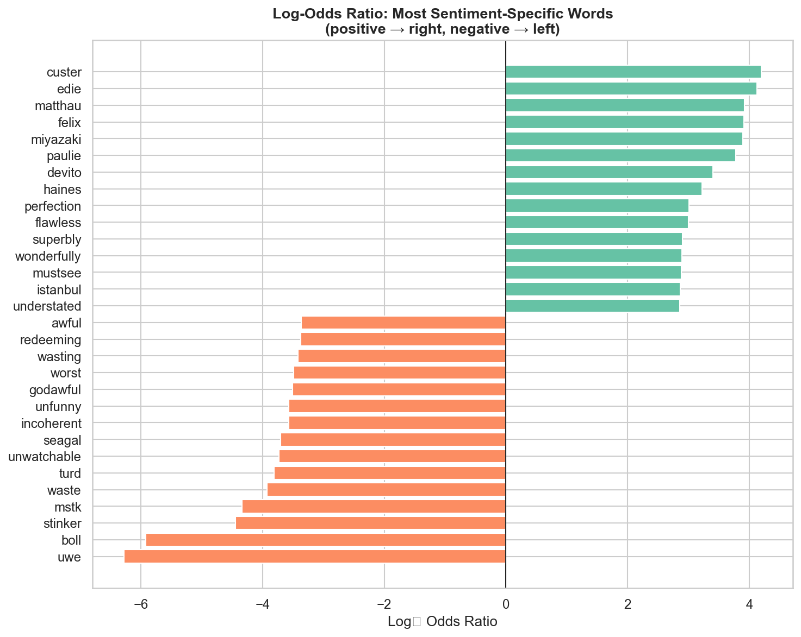

---

### 12. Word Clouds

Visual representation of the most prominent words for each class, with stopwords removed. Word size is proportional to frequency.

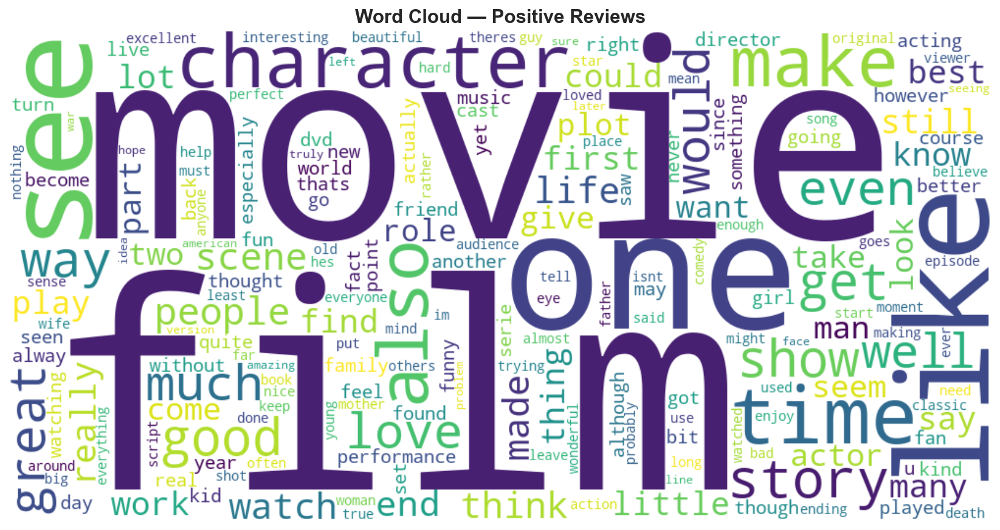

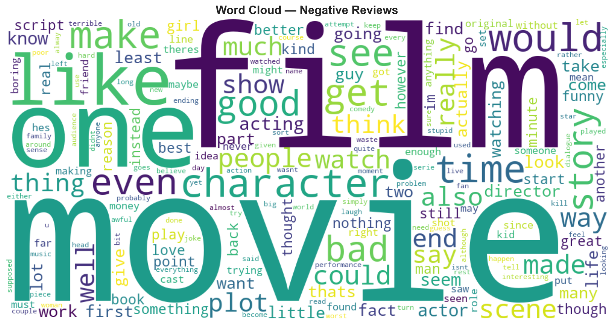

---

### 13. Type-Token Ratio (Vocabulary Richness)

The Type-Token Ratio (TTR) measures vocabulary diversity: `unique words / total words`. A higher TTR means a more diverse vocabulary.

- **Mean TTR:** 0.66 (both classes similar)
- Short reviews tend to have higher TTR (closer to 1.0) because repetition is less likely
- The negative correlation between TTR and word count (r = −0.75) is expected

This feature may be useful as an auxiliary input for modeling.

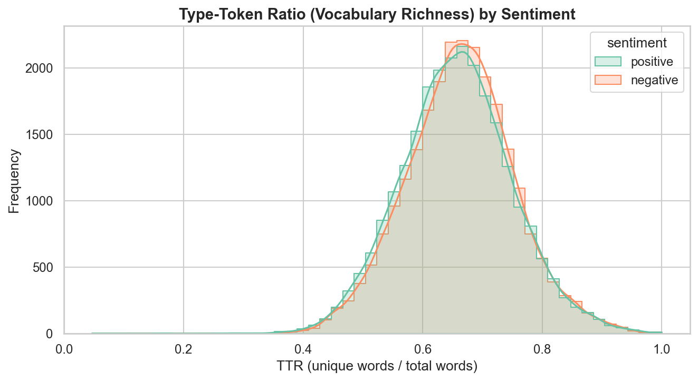

---

### 14. Zipf's Law Verification

Zipf's law states that the frequency of a word is inversely proportional to its rank. Our corpus **closely follows Zipf's law** (the data points align with the ideal 1/rank line), confirming that the dataset has a natural language distribution and is not artificially generated or biased.

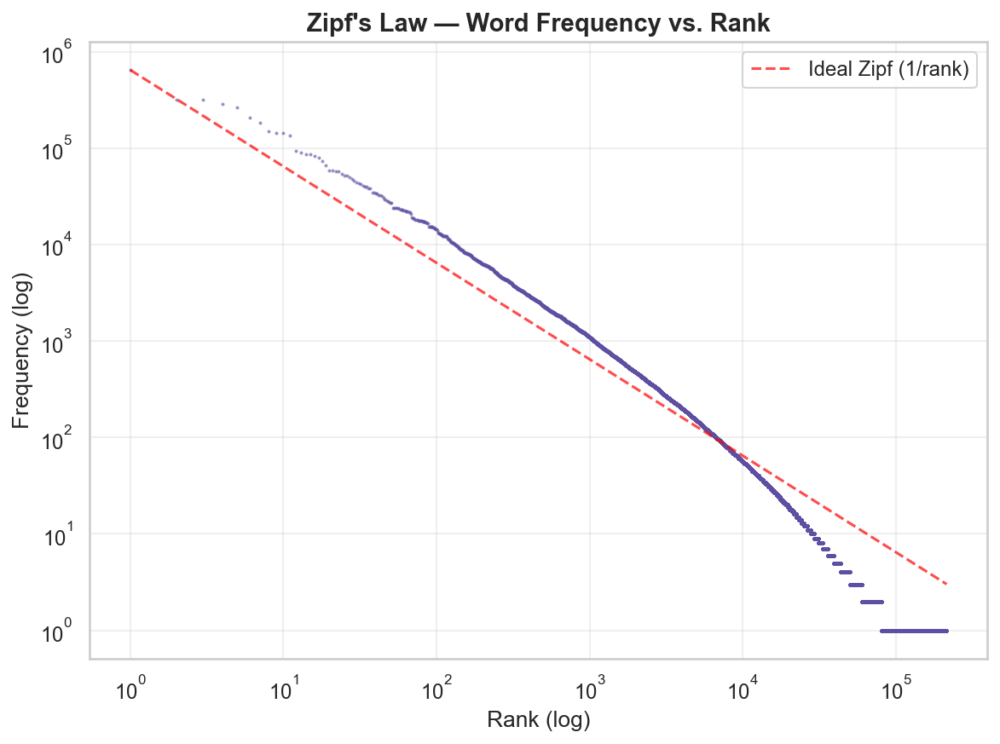

---

### 15. Punctuation Analysis

Using the lightly-cleaned text (`cleaned_review_light`), we analyzed punctuation usage:

- **Exclamation marks (!):** Median is 0 for both classes; mean ≈ 0.98. Some reviews have up to 282 exclamation marks.
- **Question marks (?):** Negative reviews use slightly more question marks (visible in the boxplot). Mean ≈ 0.65.
- **Uppercase ratio:** Near-zero because the light-cleaned text is lowercased. Future analysis could use raw text instead.

This analysis supports **Research Question 2**: punctuation carries emotional signal that aggressive cleaning removes.

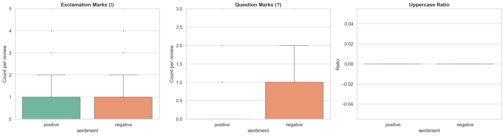

---

### 16. Feature Correlation Heatmap

The correlation heatmap reveals the relationships between all numeric features and the sentiment label:

| Feature Pair | Correlation | Interpretation |
|-------------|-------------|----------------|
| word_count ↔ char_count | 1.00 | Perfect correlation (expected) |
| word_count ↔ unique_words | 0.98 | More words → more unique words |
| word_count ↔ ttr | −0.75 | Longer reviews → lower vocabulary diversity |
| quest_count ↔ sentiment_label | −0.17 | **Negative reviews use more question marks** |
| avg_word_len ↔ sentiment_label | 0.06 | No meaningful correlation |
| word_count ↔ sentiment_label | 0.01 | **Length has almost zero correlation with sentiment** |

The strongest correlation with sentiment is `quest_count` (r = −0.17), suggesting that question marks may be a useful feature. However, no single numeric feature is a strong predictor of sentiment — confirming that **textual content (words/phrases) is far more important than structural features**.

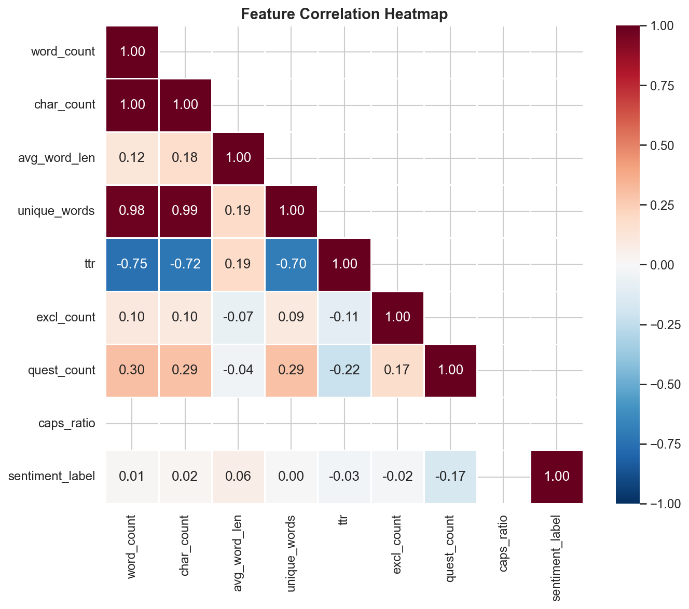

---

### 17. Sentiment Proportion by Length Bucket

This stacked bar chart shows the positive/negative ratio within each length bucket. The proportions are **remarkably stable** (~50/50) across all buckets, confirming that review length does not predict sentiment.

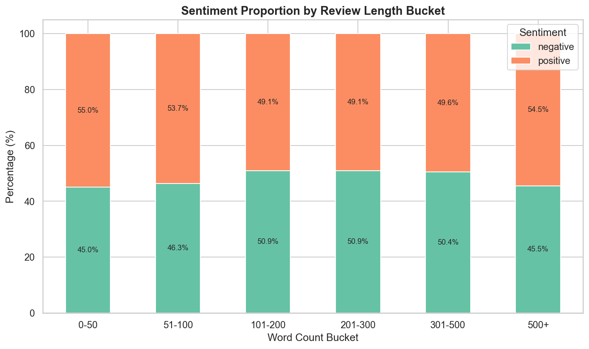

---

### 18. Empirical Cumulative Distribution (ECDF)

The ECDF of word counts shows that the cumulative distributions of positive and negative reviews are **nearly identical**. Both classes reach 50% at around 170 words and 90% at around 500 words.

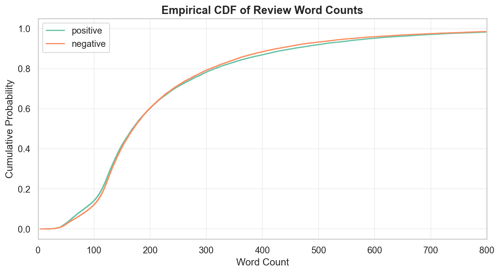

---

### Vocabulary Analysis

| Metric | Value |
|--------|-------|
| Total vocabulary size | 214,623 unique tokens |
| Positive-only vocabulary | 137,753 |
| Negative-only vocabulary | 134,225 |
| Vocabulary overlap | 57,355 tokens |
| Jaccard similarity | 0.2672 (26.72%) |

The Jaccard similarity of **26.72%** means that only about a quarter of all words are shared between the two classes. This indicates meaningful lexical differences between positive and negative reviews, which is encouraging for classification.

---

## Research Questions

### Research Question 1: Review Length and Model Behaviour

**Question:** How is the review length related to correctly classifying the sentiment of the review?

**EDA Evidence:** Figures 2, 3, 4, 17, and 18 all confirm that the word-count distribution is **nearly identical** for both classes. The stacked bar chart (Figure 17) shows a stable ~50/50 split across all length buckets. The correlation heatmap (Figure 16) confirms word_count ↔ sentiment_label correlation is just **0.01**.

**Conclusion so far:** Text length cannot be the main approach for classification. However, we still plan to categorize reviews into length groups and analyze per-bucket model accuracy to identify where the model struggles most.

### Research Question 2: The Effect of Preprocessing Intensity on Interpretability

**Question:** What is the impact of removing stop-words, punctuation, and numbers on classification accuracy?

**EDA Evidence:** The punctuation analysis (Figure 15) shows that negative reviews use more question marks (r = −0.17 with sentiment). The log-odds ratio (Figure 11) reveals that words like "dont" (a contraction broken by aggressive cleaning) are strong negative signals. This suggests that aggressive preprocessing may destroy useful information.

**Methodology:** Our pipeline generates two cleaned versions (`cleaned_review` vs. `cleaned_review_light`). We will train models on TF-IDF features from each version and compare metrics.

### Research Question 3: Linguistic Patterns in Misclassifications

**Question:** Are there common linguistic patterns in systematically misclassified reviews?

**EDA Evidence:** The TF-IDF analysis (Figure 10) and log-odds ratio (Figure 11) show that some proper nouns (actor/director names) carry strong sentiment bias. This could lead to spurious correlations where the model learns to associate certain names with sentiment rather than learning linguistic patterns. The bigram analysis (Figure 8) also shows that some phrases appear in both classes ("dont know", "even though"), which could confuse the model.

**Methodology:** After training, we will collect all misclassified reviews and compare their n-gram distributions to correctly classified ones.

---

## What Will Be Done Next

1. **Feature Extraction**
   - TF-IDF vectorization with `max_features=10,000`, `ngram_range=(1,2)`, `min_df=5`, `max_df=0.95`
   - Apply to both `cleaned_review` (aggressive) and `cleaned_review_light` columns separately

2. **Train/Test Split**
   - 80/20 stratified split (`random_state=42`) to preserve class proportions
   - Training set: ~39,666 reviews; Test set: ~9,916 reviews

3. **Modeling**
   - **Baseline:** Logistic Regression (L2 regularization, `C=1.0`)
   - **Alternative:** Multinomial Naive Bayes (`alpha=1.0` Laplace smoothing)
   - **Stretch goal:** Linear SVM (`LinearSVC`) if time permits

4. **Evaluation**
   - Metrics: Accuracy, Precision, Recall, F1-Score (macro & per-class), ROC-AUC
   - Confusion matrix visualization
   - ROC curve comparison across models
   - Cross-validation: 5-fold stratified CV on the training set

5. **Error Analysis** (Research Question 3)
   - Collect all false positives and false negatives
   - Analyze word-count distribution of misclassified vs. correctly classified reviews
   - Extract top distinguishing n-grams from errors
   - Length-bucket breakdown of error rates

6. **Preprocessing Comparison** (Research Question 2)
   - Re-run the full pipeline with light-cleaned text
   - Compare metrics side-by-side in a summary table

### Timeline

| Week | Task |
|------|------|
| Week 1 | Feature extraction (TF-IDF), train/test split |
| Week 2 | Logistic Regression + Naive Bayes training & evaluation |
| Week 3 | Error analysis, preprocessing comparison experiment |
| Week 4 | Final report, visualizations, and documentation |

### Potential Challenges

- **Sarcastic Reviews:** Sarcasm inverts the literal meaning; a bag-of-words model may struggle. We will flag potential sarcasm cases in the error analysis.
- **Efficient Use of Resources:** TF-IDF with large vocabulary can be memory-intensive. We will cap `max_features` at 10,000 to keep memory usage reasonable.
- **Class Overlap in Language:** The Jaccard similarity of 26.72% and the top-N word overlap suggest that many common words are shared between classes. Discriminative power comes from rarer, sentiment-specific terms.

---

## How to Run the Project

### 1. Clone the repository

```bash
git clone https://github.com/BILGI-IE-423/ie423-2025-2026-termproject-absolutecinema.git
cd ie423-2025-2026-termproject-absolutecinema
```

### 2. Install packages

```bash
pip install -r requirements.txt
```

### 3. Place the data file

Put `IMDB Dataset.csv` in `data/raw/` (see `data/README.md`).

### 4. Run the scripts in order

```bash
python scripts/01_load_data.py
python scripts/02_preprocess_data.py
python scripts/03_basic_eda.py
```

Expected outputs: `data/processed/cleaned_imdb_reviews.csv`, `outputs/figures/*.png`, `outputs/tables/*.csv`.

---

## Transparency and Traceability

All figures and tables in this document are produced by the Python scripts in `scripts/`. The complete list:

| Output | Script |
|--------|--------|
| `outputs/tables/01_load_summary.csv` | `scripts/01_load_data.py` |
| `data/processed/cleaned_imdb_reviews.csv`, `outputs/tables/02_preprocess_summary.csv` | `scripts/02_preprocess_data.py` |
| 18 figures in `outputs/figures/` | `scripts/03_basic_eda.py` |
| `outputs/tables/03_eda_summary.csv` (80+ metrics) | `scripts/03_basic_eda.py` |
| `outputs/tables/03_top_words_*.csv` | `scripts/03_basic_eda.py` |
| `outputs/tables/03_top_bigrams_*.csv` | `scripts/03_basic_eda.py` |
| `outputs/tables/03_top_trigrams_*.csv` | `scripts/03_basic_eda.py` |
| `outputs/tables/03_tfidf_discriminative.csv` | `scripts/03_basic_eda.py` |
| `outputs/tables/03_log_odds_all.csv` | `scripts/03_basic_eda.py` |

Someone else can install the packages, use the same raw data, and run the scripts in this order to reproduce the same outputs.
